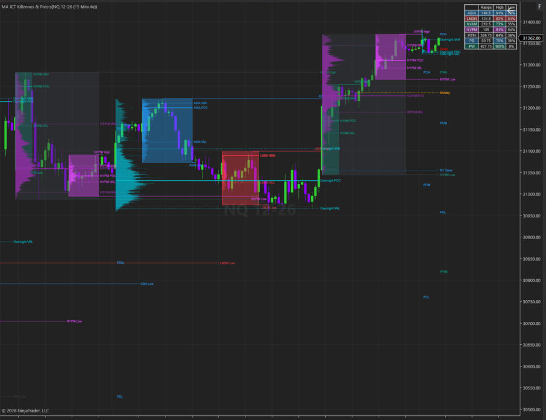

# MA ICT Killzones & Pivots

**Session killzones, pivots, range projections, D/W/M levels and a real-volume Session Volume Profile for NinjaTrader 8 and ATAS.**

[Website](https://mohamed-abdelaziz.com) · [Product page](https://mohamed-abdelaziz.com/en/learning/tools/ma-ict-killzones-pivots) · [صفحة المنتج](https://mohamed-abdelaziz.com/ar/learning/tools/ma-ict-killzones-pivots) · [Downloads](#downloads) · [Installation](#installation) · [Changelog](CHANGELOG.md) · [License](LICENSE.md)

NinjaTrader 8, NQ 15-minute: killzone boxes with Session Volume Profiles, POC / VAH / VAL, pivots, previous day/week levels and the statistics table.

---

## Overview

MA ICT Killzones & Pivots maps the trading day into configurable time-of-day sessions ("killzones") and plots the levels that each session leaves behind: its high, low and midpoint, projected range levels, previous day / week / month levels, opening prices and time markers. Each level carries hit-rate statistics so you can see how often it has been reached historically.

An optional **Session Volume Profile** builds an independent volume profile for every session from **real traded volume at each price** and plots its **POC, VAH and VAL**. Two additional profile sessions, **Overnight** and **US Full**, are calculated on New York time.

The indicator is a charting and analysis tool. It does not place orders.

## Key features

### Sessions and killzones
- Up to **six configurable killzones**, each with its own name, color and `HHMM-HHMM` time window. Defaults: ASIA 20:00–00:00, LNDN 02:00–05:00, NYAM 09:30–11:00, NYL 12:00–13:00, NYPM 13:30–16:00, RTH 09:30–16:00.
- Sessions that cross midnight are supported.
- Session boxes that grow with the session's high and low, with a configurable **session limit** (history depth).
- Timezone: **America/New_York with automatic daylight-saving handling**, or fixed GMT offsets.

### Pivots
- Session **high, low and optional midpoint** lines with labels.
- Extension modes: *until mitigated* or *past mitigation*, from the most recent session or all kept sessions.
- **Hit-rate statistics** for session highs and lows.
- **Alerts** when a session high or low is broken (real-time).

### Range data and levels
- Session range measured by **average, median or standard deviation** over a configurable lookback.
- **Range-projection levels** above and below each session open at configurable multipliers and colors, with per-level hit rates.

### Day / Week / Month
- **Previous day, week and month high, low and midline**, optional day/week/month **opening prices** and dividers.
- History: most recent, session limit, or unlimited.
- Hit-rate statistics and **break alerts**.
- Optional day-of-week labels.

### Opening prices and timestamps
- Custom **opening-price lines** (time, color, label) — defaults 09:30 NY Open, 12:00 Midday, 16:00 Close.
- Custom **vertical time markers** — defaults 09:30, 12:00, 16:00.
- Optional **drawing cutoff time** and **timeframe limit**.

### Statistics table
- In-chart table with current session ranges, pivot hit rates, range-level hit rates and previous day/week/month hit rates. Position and size are configurable; a statistic is only shown when the feature that produces it is enabled.

### Session Volume Profile
- Optional, independent profile **per killzone**, plus two profile sessions on **New York time**:
  - **Overnight:** 18:00 → 09:29 New York (last minute 09:29; the session ends at 09:30)
  - **US Full:** 09:30 → 16:00 New York (last minute 15:59; the session ends at 16:00)
- **POC, VAH and VAL**, each can be shown or hidden, with configurable line style and width and optional labels.
- **Value Area %** configurable (default **70%**), single-row or two-row value-area expansion from the POC.
- Optional **histogram** of the volume distribution by price, shaded inside / outside the value area.
- Optional **extension** of the levels after the session ends. History follows the session limit.

## Real-volume methodology

The Session Volume Profile only uses volume that the platform actually reports at each price. It never spreads a bar's volume across its high/low range and never reconstructs bid/ask volume.

| | NinjaTrader 8 | ATAS |
|---|---|---|
| Volume source | 1-tick trade series (default), Volumetric bars (Order Flow+), or single-price bar volume | ATAS cluster (volume-at-price) data |
| Row size | 1 tick | Configurable ticks per row (default 1) |

When a session does not have the required data, the indicator shows **Insufficient Data** or **Approximation Not Available** on the chart instead of drawing levels.

**Data requirements**
- **NinjaTrader 8:** historical tick data for the loaded days (Tick Replay is *not* required). The Volumetric source requires Volumetric bars (NinjaTrader Order Flow+).
- **ATAS:** cluster (volume-at-price) history for the loaded days.

## Compatibility

| Platform | Tested version | Runtime |
|---|---|---|
| NinjaTrader 8 | 8.1.8.3 | NinjaTrader 8 desktop |
| ATAS | 8.0.15.302 | .NET 10 (bundled with ATAS) |

## Platform comparison

| Feature | NinjaTrader 8 | ATAS |
|---|:---:|:---:|
| Killzones (6 configurable sessions) | Supported | Supported |
| Session boxes and session limit | Supported | Supported |
| New York timezone with DST / fixed GMT offsets | Supported | Supported |
| Pivot high / low / midpoint and labels | Supported | Supported |
| Pivot hit-rate statistics | Supported | Supported |
| Range levels (average / median / standard deviation) | Supported | Supported |
| Previous day / week / month high, low, midline | Supported | Supported |
| Day / week / month opens and dividers | Supported | Supported |
| Opening-price lines | Supported | Supported |
| Timestamps (vertical markers) | Supported | Supported |
| Day-of-week labels | Supported | Supported |
| Statistics table | Supported | Supported |
| Drawing cutoff time / timeframe limit | Supported | Supported |
| Alerts (pivot and D/W/M breaks) | Supported | Supported |
| Session Volume Profile per killzone | Supported | Supported |
| Overnight session profile (18:00–09:29 NY) | Supported | Supported |
| US Full session profile (09:30–16:00 NY) | Supported | Supported |
| POC / VAH / VAL | Supported | Supported |
| Configurable Value Area % | Supported | Supported |
| Volume histogram | Supported | Supported |
| Level extension | Supported | Supported |
| Configurable ticks per row | — (1 tick) | Supported |
| Selectable volume data source | Supported | — (ATAS cluster data) |
| Historical and real-time calculation | Supported | Supported |

**Platform notes**
- Day / week / month changes follow NinjaTrader's Trading Hours template on NinjaTrader 8 and the chart's session settings on ATAS.
- Alerts are delivered through each platform's own alert system and only fire on real-time data.
- Text entries (opening prices, timestamps, range multipliers) are separated with `;`.

## Downloads

Binaries are distributed through **[GitHub Releases](https://github.com/m4whw/MA-ICT-Killzones-Pivots/releases)**. Each platform has its own package:

| Package | Platform | Status |
|---|---|---|
| [`MA-ICT-Killzones-Pivots-NinjaTrader-v1.0.0.zip`](https://github.com/m4whw/MA-ICT-Killzones-Pivots/releases/download/v1.0.0-ninjatrader/MA-ICT-Killzones-Pivots-NinjaTrader-v1.0.0.zip) | NinjaTrader 8 | Released — v1.0.0 ([release page](https://github.com/m4whw/MA-ICT-Killzones-Pivots/releases/tag/v1.0.0-ninjatrader)) |
| [`MA-ICT-Killzones-Pivots-ATAS-v1.0.0.zip`](https://github.com/m4whw/MA-ICT-Killzones-Pivots/releases/download/v1.0.0/MA-ICT-Killzones-Pivots-ATAS-v1.0.0.zip) | ATAS | Released — v1.0.0 ([release page](https://github.com/m4whw/MA-ICT-Killzones-Pivots/releases/tag/v1.0.0)) |

A package is published only after it has been built and verified on its platform. Packages contain compiled binaries only.

Full product guide — features, how to read the levels, installation and video resources: **[English](https://mohamed-abdelaziz.com/en/learning/tools/ma-ict-killzones-pivots)** · **[العربية](https://mohamed-abdelaziz.com/ar/learning/tools/ma-ict-killzones-pivots)**

## Installation

- **NinjaTrader 8:** see [docs/installation-ninjatrader.md](docs/installation-ninjatrader.md)
- **ATAS:** see [docs/installation-atas.md](docs/installation-atas.md)

## Support

Product information and support: **[mohamed-abdelaziz.com](https://mohamed-abdelaziz.com)**

- Product page (English): https://mohamed-abdelaziz.com/en/learning/tools/ma-ict-killzones-pivots
- صفحة المنتج (العربية): https://mohamed-abdelaziz.com/ar/learning/tools/ma-ict-killzones-pivots

## License

Copyright © 2026 Mohamed Abdelaziz. All rights reserved.

Proprietary software. Unauthorized copying, redistribution, modification, reverse engineering, decompilation, disassembly, extraction, resale, sublicensing, or commercial redistribution is prohibited, subject to applicable law. See [LICENSE.md](LICENSE.md).

The product includes a component licensed under the Mozilla Public License 2.0; its notice and source-availability terms are listed separately in [THIRD-PARTY-NOTICES.md](THIRD-PARTY-NOTICES.md).

**Risk disclosure:** trading futures and other leveraged instruments involves substantial risk of loss. This software is an analysis tool and does not constitute investment advice.
